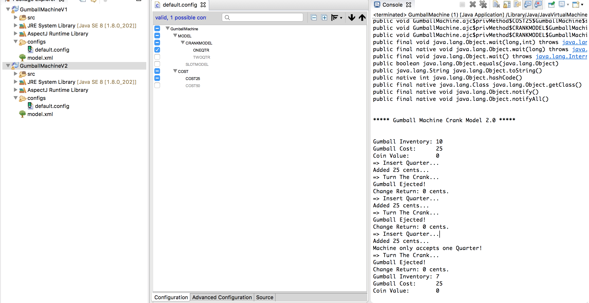
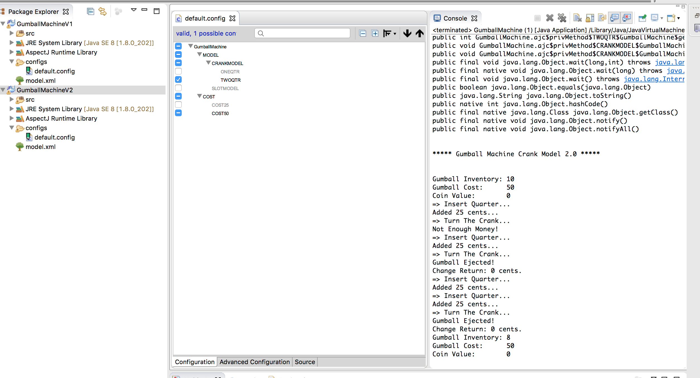
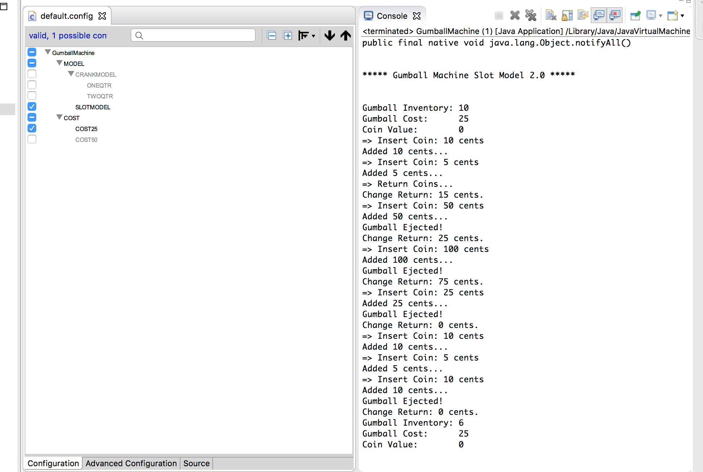
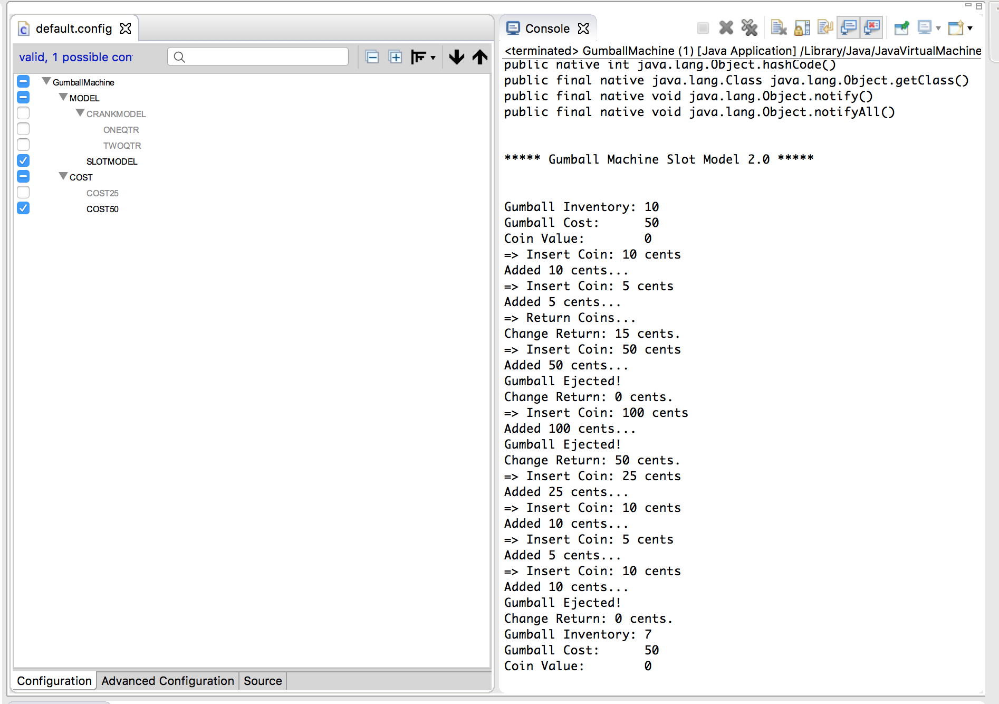

Compare:
1) This solution makes more sense and is closer to reality. 
2) This solution is much more user-friendly. Users can explicitly choose the model of the GumballMachine but don't need to be familiar with the code. 
